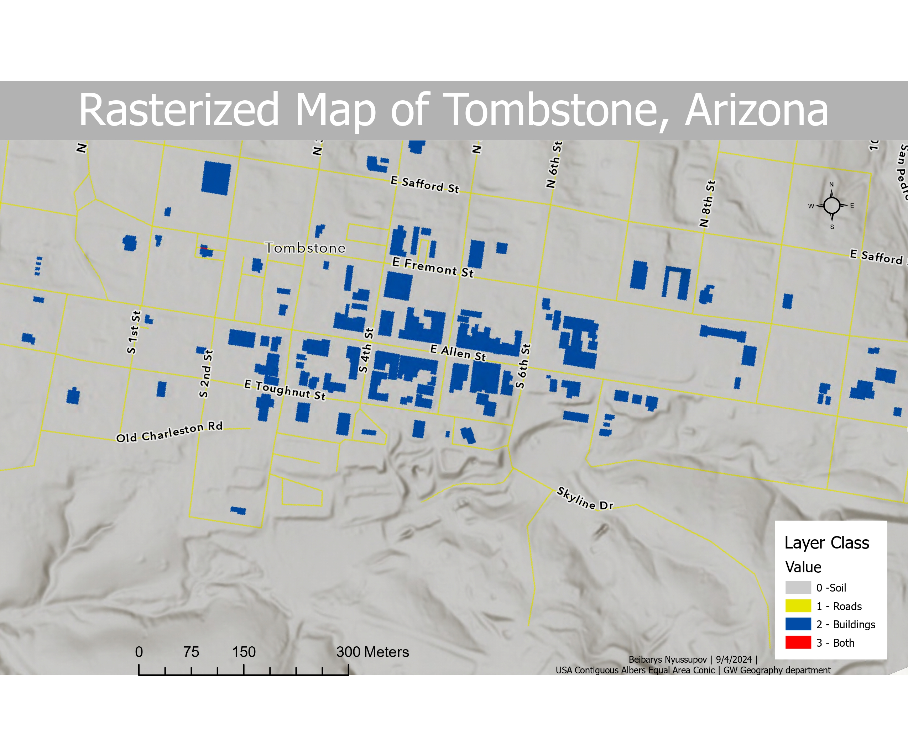

# Tombstone Rasterization
This project demonstrates practical GIS data creation, cleaning, and rasterization techniques using ArcGIS Pro. The goal was to produce a 1-meter resolution raster map of Tombstone, Arizona, encoding land-use classes for soil, roads, and buildings.

## Project Structure
- `data.csv` -
- `Data Sources` - Rotten Tomatoes, IMDb, Metacritic, Box Office Mojo.
- `Deliverable` - A 3-part data visualization illustrating the relationship between critical reception, audience sentiment, and return on investment (ROI).

## Key Insights
- Identified a post-2019 divergence between audience and critic ratings, signaling early reputation erosion.
- Analyzed revenue data to reveal how financial performance lagged after the drop in critical reception.
- Demonstrated that Marvel’s ROI peaked during Phase 3 but declined steadily through Phases 4–5, suggesting diminishing brand efficiency.
  
## Tools & Technologies
 - **ArcGIS Pro - Raster Calculator, Reclassify** 
- **QGIS**

## Deliverable 

